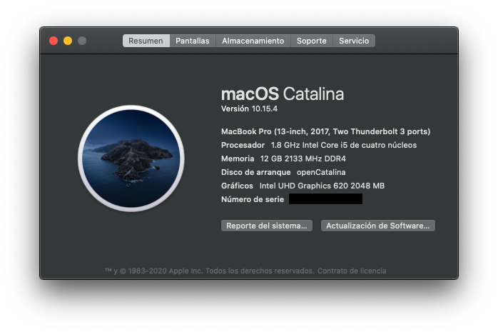

Guide structure based on [this](https://github.com/gajjartejas/Lenovo-Ideapad-320-15ISK-14ISK-Laptop-Hackintosh) one.

Open core (5.8) install [guide](https://github.com/dortania/vanilla-laptop-guide)

Clover install guide
[10.15](https://www.tonymacx86.com/threads/guide-lenovo-ideapad-330s-14ikb-i5-8250u-catalina-10-15-4-windows-10.284803/),
[10.14](https://www.tonymacx86.com/threads/guide-lenovo-ideapad-330s-14ikb-i5-8250u-mojave-10-14-6-windows-10.277874/)

---

# Hackintosh guide for Lenovo IdeaPad 320-15IKB
Goal of this repo is to run Mac os on Lenovo Ideapad 320-15IKB Laptop

macOS Mojave 10.14.6            |  macOS Catalina 10.15.4
:-------------------------:|:-------------------------:
  |  

## About this Laptop

### Hardware Status

Type | Spec | Status | Link
---------|:---------:|----------:|----------
Computer		| Lenovo Ideapad 320-15IBK 81GB   | Working | -
BIOS Version	| ? | Working | -
CPU				| Intel Core i5-8250U @ 1.60GHz | Working | [Intel](https://ark.intel.com/content/www/us/en/ark/products/124967/intel-core-i5-8250u-processor-6m-cache-up-to-3-40-ghz.html)
Chipset			| ? | Working | -
Graphics		| Intel® UHD Graphics 620 | Working | - 
Audio			| ? (audio layout 20) | Working | - 
Ethernet		| ? | Working | -
WiFi			| ? | Not Working | -
Bluetooth		| ? | Working | -
Touchpad		| ? | Working | -
Keyboard		| - | Working | -
Webcam		| ? | Working | -
Battery		|   ? | Working | -

## Software Status

Type | Spec | Status
---------|:---------:|:----------:
Battery Status		| - | Working
Brightness		| - | Working
Sleep/Hibernate		| - | Weird issue

## Modifications

Type | Spec | Status
---------|:---------:|----------
ADATA SU800 512GB		| - | Working
Xiaomi Mi Wireless Mouse		| - | Working
Logitech K540 Wireless Keyboard		| - | Working

## Kext Used

Kext | Link | Status
---------|:---------:|----------
AppleALC.kext | - | Working
HoRNDIS | [Install](https://github.com/jwise/horndis) | Working
Lilu.kext | - | Working
RealtekRTL8111.kext | - | Working
SMCBatteryManager.kext | - | Working
SMCProcessor.kext | - | Working
SMCSuperIO.kext | - | Working
VirtualSMC.kext | - | Working
VoodooI2C.kext  | - | Working
VoodooI2CHID.kext  | - | Working
VoodooPS2Controller.kext  | - | Working
WhateverGreen.kext | - | Working
